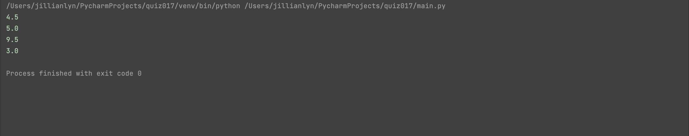

# Quiz 017

## Solution to Quiz #017 (SL)

```.py
def averageWord(given:list):
    length = (len(char) for char in given)
    output = sum(length)/len(given)
    return output

test1 = averageWord(["hello", "main"])
print(test1)
test2 = averageWord(["Peru", "France", "Nepal"])
print(test2)
test3 = averageWord(["Computer Science", "Art"])
print(test3)
test4 = averageWord(["one", "two"])
print(test4)
```

## Proof of Working Solution


