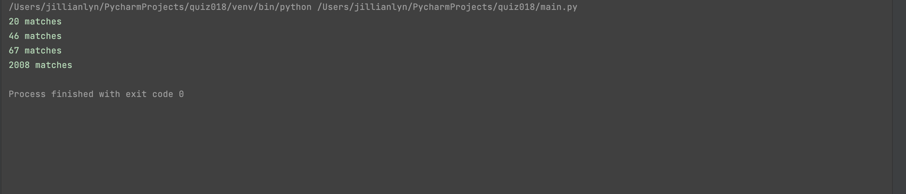

'''.py
def ceil(num):
    return int(-1 * num // 1 * -1)

def numberMatches(l:int, s:int):
    output = ceil(((l * 100) / (5 * s)))
    return output

out = numberMatches(l=100, s=100)
print(f"{out} matches")
out2 = numberMatches(l=250, s=110)
print(f"{out2} matches")
out3 = numberMatches(l=500, s=150)
print(f"{out3} matches")
out4 = numberMatches(l=12345, s=123)
print(f"{out4} matches")
'''

