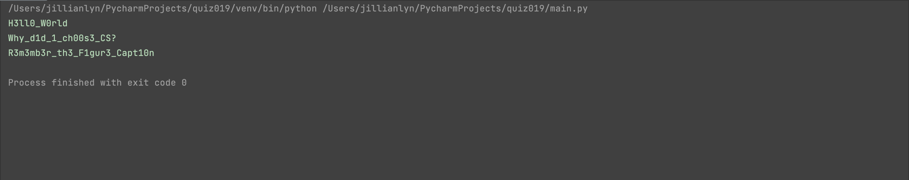

# Quiz 019

## Solution to Quiz #019

```.py
def get_l3tt3r(msg:str):
    output = ""
    for i in msg:
        if i == 'e' or i == 'E':
            output += '3'
        elif i == ' ':
            output += '_'
        elif i == 'i' or i == 'I':
            output += '1'
        elif i == 'o' or i == 'O':
            output += '0'
        else:
            output += i
    return output

case1 = get_l3tt3r(msg="Hello World")
print(case1)
case2 = get_l3tt3r(msg="Why did I choose CS?")
print(case2)
case3 = get_l3tt3r(msg="Remember the Figure Caption")
print(case3)
```

## Proof of Working Code



## HL Circuit


