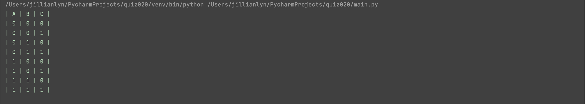
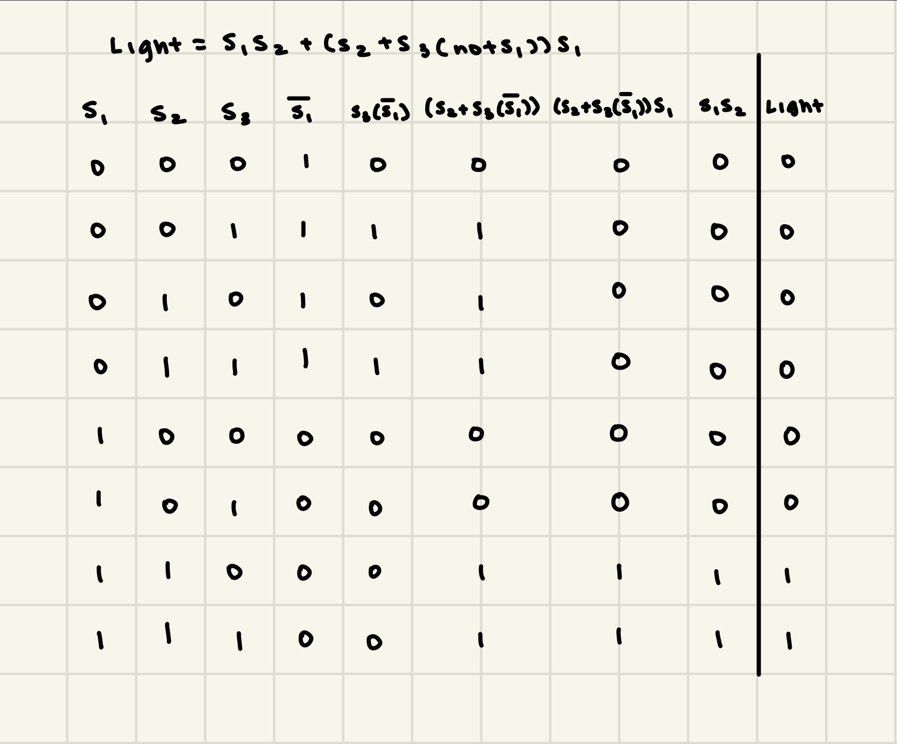
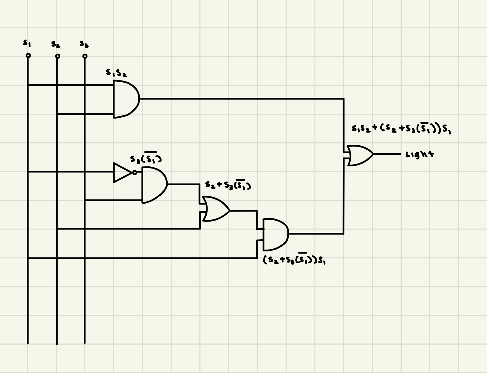

# Quiz 020

## Solution to Quiz #020

```.py
def get_truth():
    a = True
    b = True
    c = True
    print("| A | B | C |")
    for num in range(8):
        if num % 1 == 0:
            c = not c
        if num % 2 == 0:
            b = not b
        if num % 4 == 0:
            a = not a
        print(f"| {int(a)} | {int(b)} | {int(c)} |")

get_truth()
```

## Proof of Working Solution



## HL Truth Table



## HL Circuit


