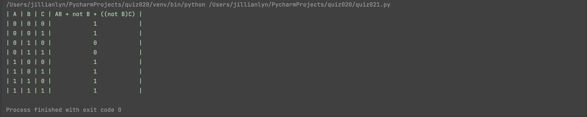
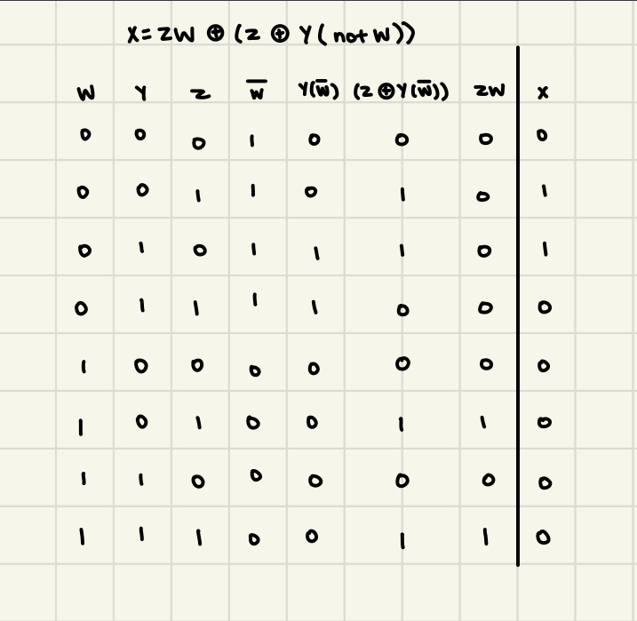
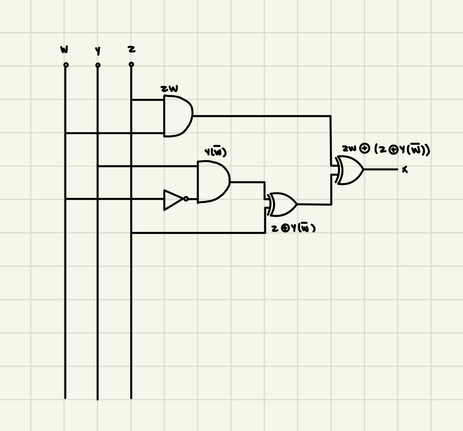

# Quiz 021

## Solution to Quiz #021

```.py
def get_truth():
    a = True
    b = True
    c = True
    d = True
    print("| A | B | C | AB + not B + ((not B)C) |")
    for num in range(8):
        if num % 1 == 0:
            c = not c
        if num % 2 == 0:
            b = not b
        if num % 4 == 0:
            a = not a
        d = int(a and b) or int(not b) or int((not b) and c)
        print(f"| {int(a)} | {int(b)} | {int(c)} |            {d}            |")

get_truth()
```

## Proof of Working Solution 



## HL Truth Table



## HL Circuit


