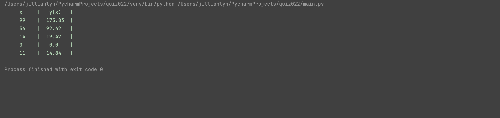
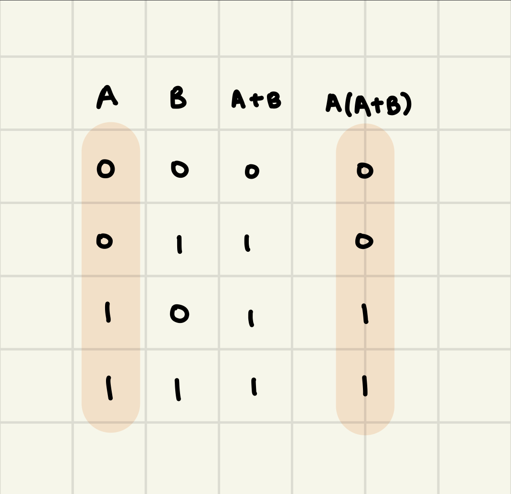

# Quiz 022

## Solution to Quiz #022

```.py
import random
random.seed(1234)
def produce(n=int,m=int,s=int):
    print(f"|{'x'.center(10)}|{'y(x)'.center(10)}|")
    for num in range(n):
        x = random.randint(0,100)
        y = x**(1/2*(m/s)**2)
        x = str(x)
        y = str(round(y,2))
        print(f"|{x.center(10)}|{y.center(10)}|")

produce(n=5,m=3,s=2)
```

## Proof of Working Solution



## Truth Table proving A(A+B)=A



