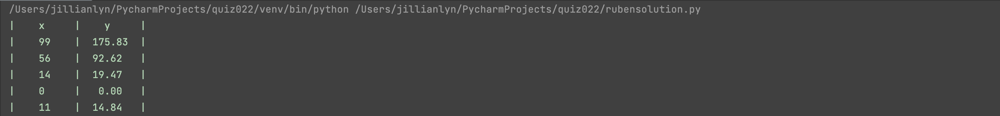
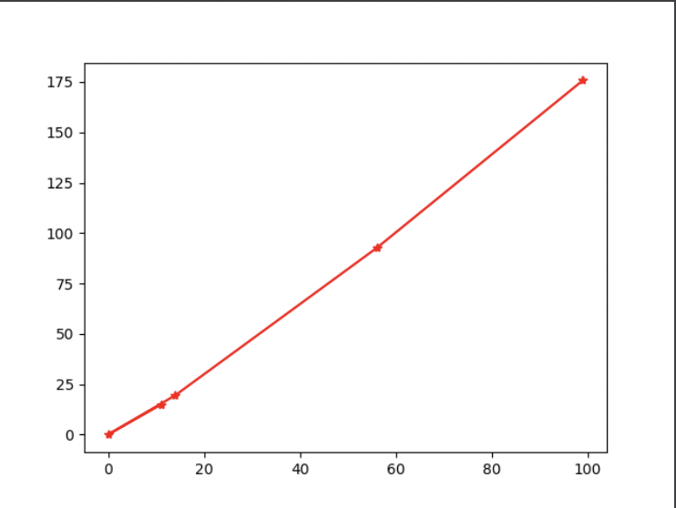
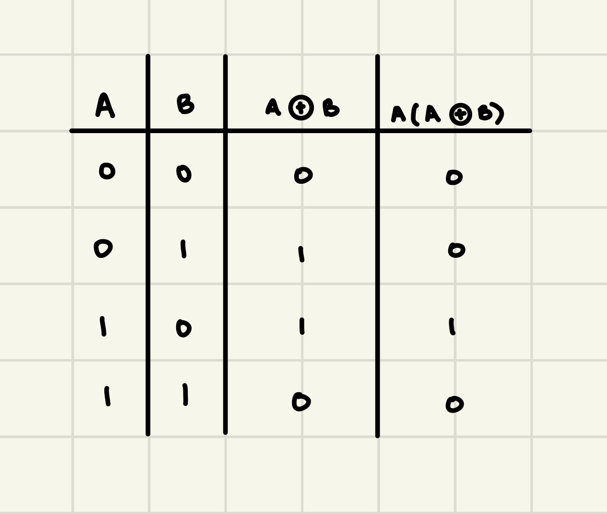

# Quiz 023

## Solution to Quiz #023

```.py
import random
random.seed(1234)
def produce (n:int,m:int,s:int):
    print(f"|{'x'.center(10)}|{'y'.center(10)}|")
    x_out = []
    y_out = []
    for _ in range(n):
        x = random.randint(0,100)
        x_out.append(x)
        y = x**(1/2*((m/s)**2))
        y_out.append(y)
        y_str = f"{y:.2f}"
        print(f"|{str(x).center(10)}|{y_str.center(10)}|")

    return y_out, x_out

from matplotlib import pyplot as plt

data_y, data_x= produce (n=5,m=3,s=2)
plt.plot(data_x, data_y, color="red", marker="*")
plt.show()
```

## Proof of Working Solution




## Truth Table for A(A ⊕ B)


