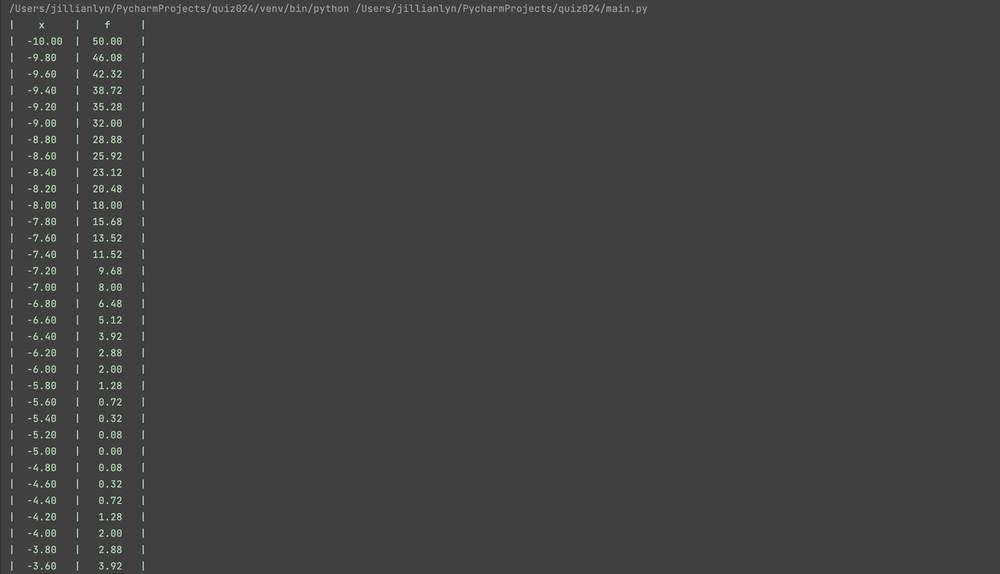

# Quiz 024

## Solution to Quiz #024

```.py
def produce():
    st = -10
    len = 10
    x_out = []
    y_out = []
    print(f"|{'x'.center(len)}|{'f'.center(len)}|")
    for i in range(101):
        x_out.append(st)
        y = 2 * (st + 5) ** 2
        y_out.append(y)
        print("|" + f"{st:0.2f}".center(len) + "|" + f"{y:0.2f}".center(len) + "|")
        st += 0.2
    return x_out, y_out

data_x, data_y = produce()
from matplotlib import pyplot as plt
plt.plot(data_x, data_y, color="red", marker="*")
plt.show()
```

## Proof of Working Solution




