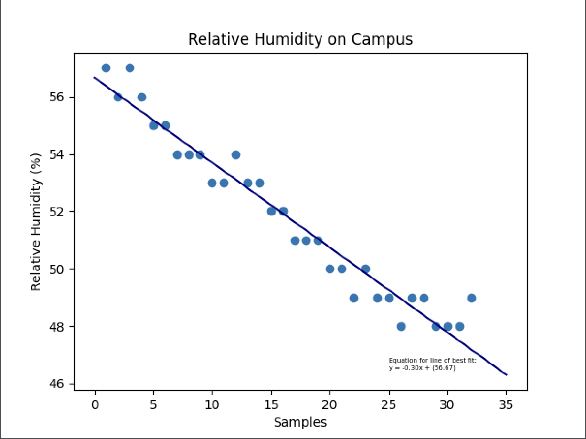

# Quiz 026

## Solution to Quiz #026

```.py
from matplotlib import pyplot as plt
import numpy as np

x = []
h = [57.0, 56.0, 57.0, 56.0, 55.0, 55.0, 54.0, 54.0, 54.0, 53.0, 53.0, 54.0, 53.0, 53.0, 52.0, 52.0, 51.0, 51.0, 51.0, 50.0, 50.0, 49.0, 50.0, 49.0, 49.0, 48.0, 49.0, 49.0, 48.0, 48.0, 48.0, 49.0]

for num in range(1,33):
    x.append(num)

plt.xlabel("Samples")
plt.ylabel("Relative Humidity (%)")
plt.title("Relative Humidity on Campus")

plt.scatter(x,h)

m,b = np.polyfit(x,h,1)
print(f"Linear equation is y={m:.2f}x+({b:.2f})")
x_model = [0,35]
y_model = []
for i in x_model:
    y_model.append(m*i+b)

plt.text(25, 46.5, f"""Equation for line of best fit: 
y = {m:.2f}x + ({b:.2f})""", fontsize=5)
plt.plot(x_model,y_model,color="navy")

plt.show()
```

## Proof of Working Solution


