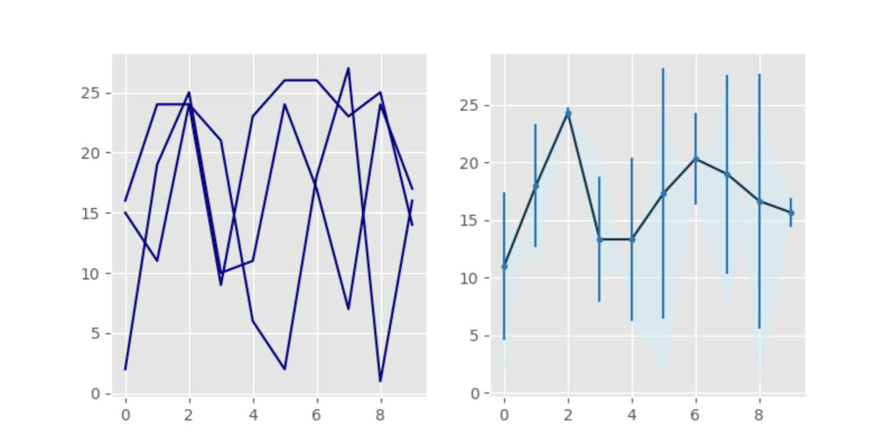

# Quiz 027

## Solution to Quiz #027

```.py
from matplotlib import pyplot as plt
import time
import numpy as np
plt.style.use('ggplot')

x = []
sensorA = [16, 24, 24, 9, 23, 26, 26, 23, 25, 14]
sensorB = [2, 19, 25, 10, 11, 24, 17, 7, 24, 17]
sensorC = [15, 11, 24, 21, 6, 2, 18, 27, 1, 16]

for num in range(1,11):
    x.append(num)

time = []
for i in range(len(sensorA)):
    time.append(i)

fig = plt.figure(figsize=(8,4))
plt.subplot(1,2,1)
plt.plot(time, sensorA, color="navy")
plt.plot(time, sensorB, color="navy")
plt.plot(time, sensorC, color="navy")

mean = []
standard_deviation = []
for s in range(len(sensorA)):
    data = [sensorA[s], sensorB[s], sensorC[s]]
    mean.append(np.mean(data))
    standard_deviation.append(np.std(data))
plt.subplot(1, 2, 2)
plt.plot(time, mean, color="#003049")
plt.fill_between(time, sensorB, sensorC, alpha=.5, color="#caf0f8")
plt.errorbar(time, mean, standard_deviation, fmt=".", color="#0077b6")

plt.show()
```

## Proof of Working Solution 



## Convert the following rgb color to hex color: red=250, green=100, blue=10

hex color = #FA640A
