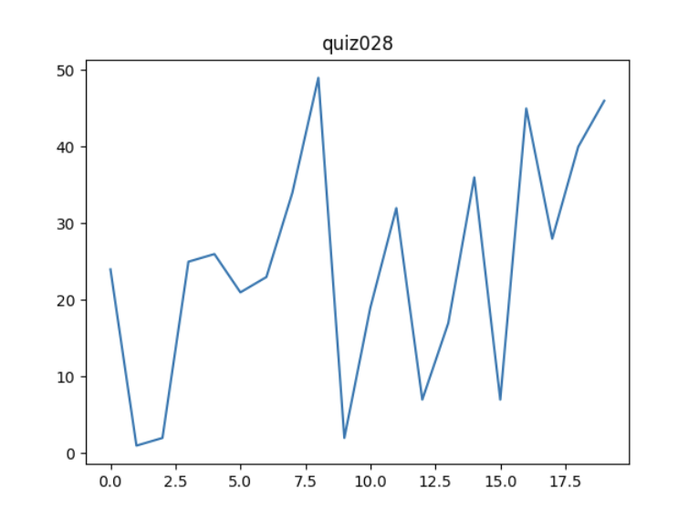

# Quiz 028

## Solution to Quiz #028

```.py
from matplotlib import pyplot as plt

data = {
    'x': [0, 1, 2, 3, 4, 5, 6, 7, 8, 9, 10, 11, 12, 13, 14, 15, 16, 17, 18, 19],
    'y': [24, 1, 2, 25, 26, 21, 23, 34, 49, 2, 19, 32, 7, 17, 36, 7, 45, 28, 40, 46],
    'title':'quiz028'
}

plt.plot(data['x'], data['y'])
plt.title(data['title'])
plt.show()
```

## Proof of Working Solution 



## Convert the following rgb color to hex color: red=10, green=255, blue=255


hex color = # 0AFFFF

