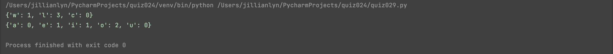

# Quiz 029

## Solution to Quiz #029

```.py
def count_letters(lexicon, msg):
    for letters in msg:
        if letters in lexicon.keys():
            lexicon[letters] += 1
    return lexicon

case1 = count_letters({'w': 0, 'l': 0, 'c': 0}, "hello world")
print(case1)
case2 = count_letters({'a': 0, 'e': 0, 'i': 0, 'o': 0, 'u': 0}, "Why did I choose CS?")
print(case2)
```

## Proof of Working Solution


