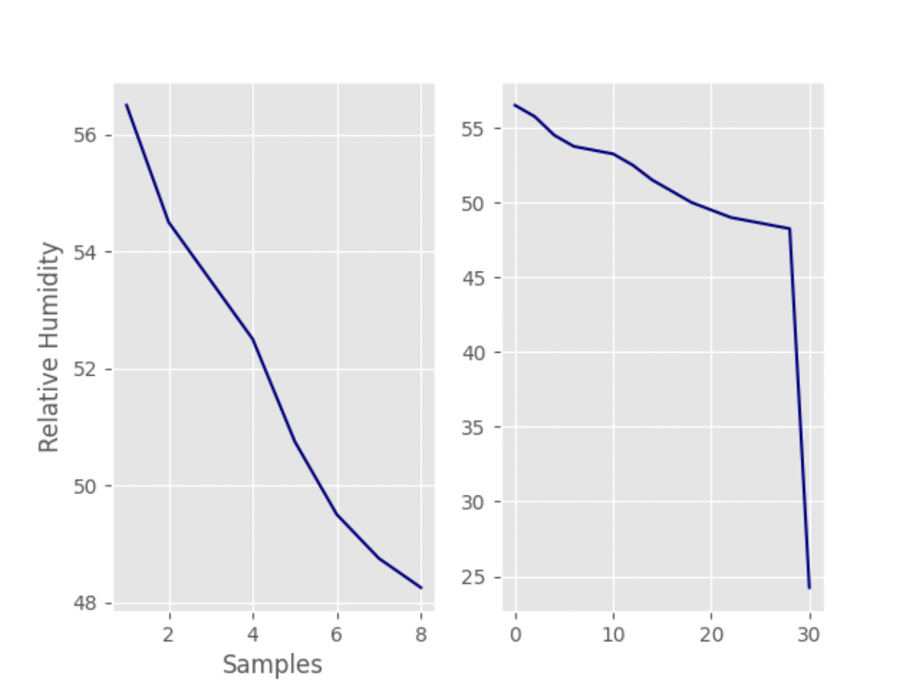

# Quiz 030

## Solution to Quiz #030 (SL Graph on the left, HL graph on the right)

```.py
from matplotlib import pyplot as plt
plt.style.use('ggplot')
plt.tight_layout()

x = []
h = [57.0, 56.0, 57.0, 56.0, 55.0, 55.0, 54.0, 54.0, 54.0, 53.0, 53.0, 54.0, 53.0, 53.0, 52.0, 52.0, 51.0, 51.0, 51.0, 50.0, 50.0, 49.0, 50.0, 49.0, 49.0, 48.0, 49.0, 49.0, 48.0, 48.0, 48.0, 49.0]
samples_per_window = 4
mean_per_window = []
y_overlap_50 = []
x_overlap_50 = []

for i in range(1,9):
    x.append(i)

for i in range(0, len(h), samples_per_window):
    data = h[i:i+samples_per_window]
    mean_per_window.append(sum(data)/samples_per_window)
plt.subplot(1, 2, 1)
plt.plot(x, mean_per_window, color="navy")
plt.xlabel("Samples")
plt.ylabel("Relative Humidity")

for i in range(0, len(h), int(samples_per_window*0.5)):
    data = h[i:(i+samples_per_window)]
    y_overlap_50.append(sum(data)/samples_per_window)
    x_overlap_50.append(i)
plt.subplot(1, 2, 2)
plt.plot(x_overlap_50, y_overlap_50, color="navy")

plt.show()
```

## Proof of Working Solution


