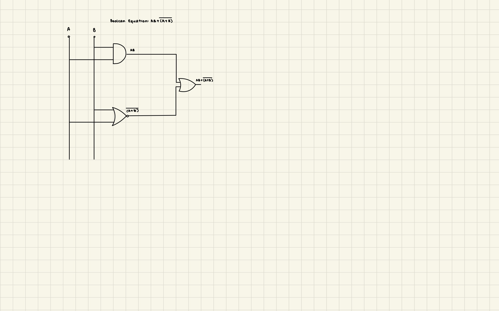
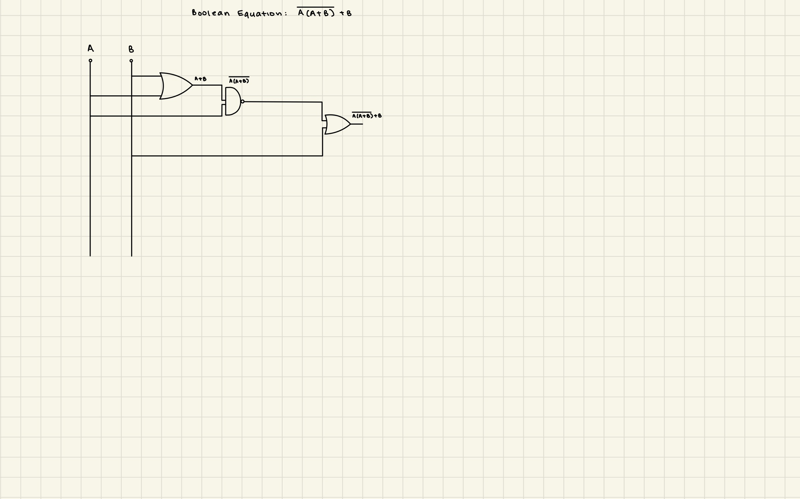
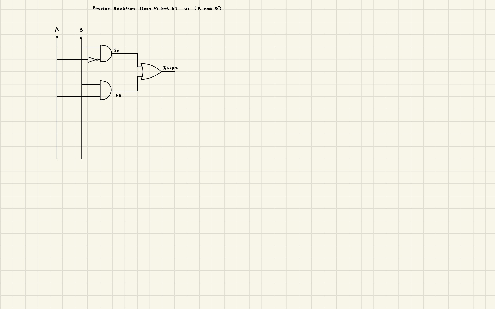
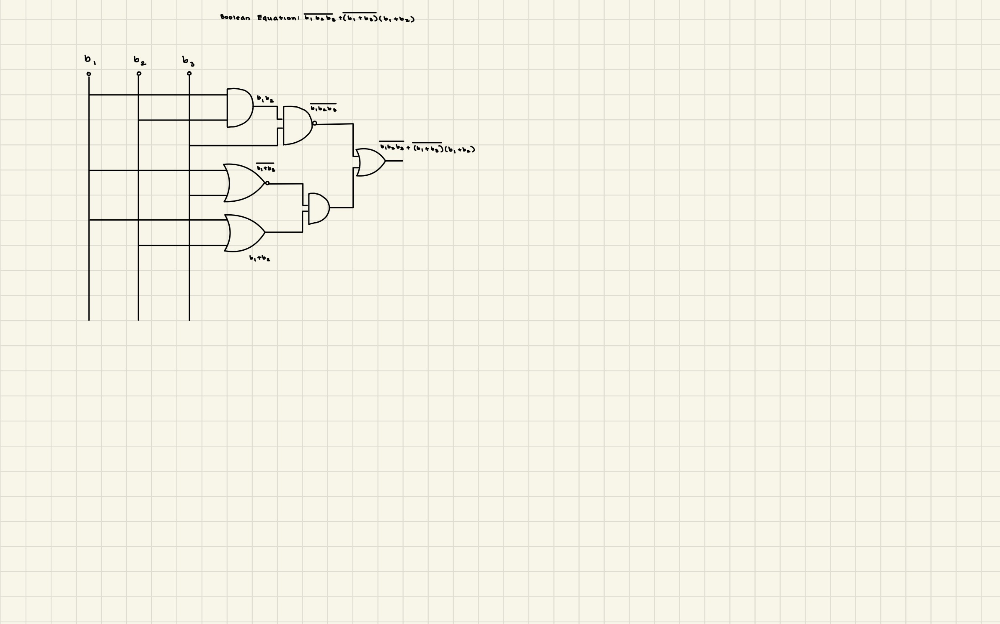
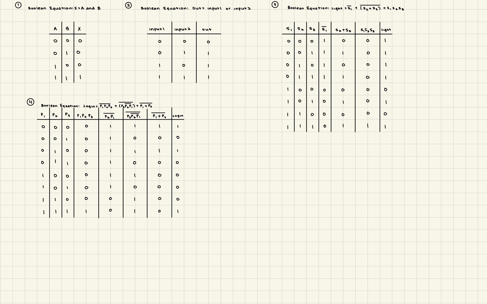

# Task 1: Data Representation and Boolean Logic 

## Boolean Logic: Draw the circuit for the boolean equations provided

1. 

2. 

3.

4.

5.

## Get the Equation: Write the boolean equation for the circuit shown

## Truth table: Write the truth table for the equations below

